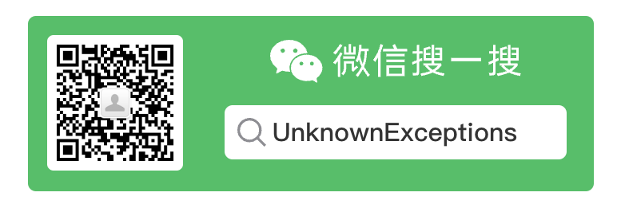

# HASS官方app高德定位版! 
[](https://github.com/nesror/Home-Assistant-Companion-for-Android/releases/latest)
[](https://github.com/nesror/Home-Assistant-Companion-for-Android/stargazers)
[](https://github.com/nesror/Home-Assistant-Companion-for-Android/issues)

[](https://github.com/nesror/Home-Assistant-Companion-for-Android/actions/workflows/main.yml)

### 公众号  
关注公众号及时获取最新版，各种使用技巧以及Hass的新奇玩法(回复 最新版 可以获取最新版的下载地址)




## [使用方法](https://mp.weixin.qq.com/s?__biz=MzIzOTU5NTEwMQ==&mid=2247483691&idx=1&sn=503ee797e03a1227539e5aa36144a2af&chksm=e926fa19de51730f5a26d3050675c4e04bd90497fd2bb2a614451d8fdf8f3c97ac478bfab36d#rd)：
* [APP使用](https://www.bilibili.com/video/BV18W4y1p7mk)
* [推送通知](https://www.bilibili.com/video/BV18T411C7LE/)
* [地理围栏](https://www.bilibili.com/video/BV1HD4y1v7r4) 
* [快捷开关，快捷方式，小部件](https://www.bilibili.com/video/BV1524y1q7gE/)

#### 高德地理编码api免费每日有使用上线，如果地理编码出不来了可以下载源码进行修改。已经升级账号，一般情况下不会达到上限

* 欢迎捐赠，以便地理编码功能可以持续服务   

  

（适合没有gms服务或谷歌服务受限的用）同时修复官方app的UA问题，导致部分前端组件异常（如 高德地图）

## Documentation
If you are looking for documentation around the companion applications check out the [Home Assistant Companion Documentation](https://companion.home-assistant.io/).  This will provide you instructions on using the applications.

## Setup App Development Environment

1. Download and install [Android Studio](https://developer.android.com/studio)

2. Download / clone this repository to a folder on your computer

3. Create a Firebase project at [Firebase Console](https://console.firebase.google.com)

4. Create four Android apps, with following package names 
 - `io.homeassistant.companion.android`
 - `io.homeassistant.companion.android.debug`
 - `io.homeassistant.companion.android.minimal`
 - `io.homeassistant.companion.android.minimal.debug`

5. Now download the `google-services.json` file and put it in the _home-assistant-Android/app_ and _home-assistant-Android/wear_ folder. This file contains the configuration of the whole project (all four applications). ([You can also use the mock services file instead of generating your own](/.github/mock-google-services.json). The file should contain client IDs for all packages listed above for debugging to work properly.  **If you do not generate your own file FCM push notification will never work, only websocket notifications will**)
6. Start Android Studio, open your source code folder and check if the Gradle build will be successful using Build/Make Module "App". You might have to install the right Android SDK via Tools/SDK Manager first.
7. Run `gradlew assembleDebug` to build all debug versions, this might take a while.
8. If the build is successful, you can run the app by doing the following: click **Run** -> **Run 'app'**.
9. Connect your phone or create a new virtual device following on screen instruction
10. :tada:

If you get stuck while setting up your own environment, you can ask questions in the **#devs_mobile_apps** channel on [Discord](https://discord.gg/c5DvZ4e).

### Push Notifications

If you want to work on push notifications or use a development build with push notifications, please go the server side code [HERE](https://github.com/home-assistant/mobile-apps-fcm-push) and deploy it to your firebase project. Once you have your androidV1 URL to the deployed service, set it in to your `${GRADLE_USER_HOME}/gradle.properties` file, e.g.:
```properties
homeAssistantAndroidPushUrl=https://mydomain.cloudfunctions.net/androidV1
```

You can also define the rate limit function URL, e.g.:
```properties
homeAssistantAndroidRateLimitUrl=https://mydomain.cloudfunctions.net/checkRateLimits
```

## App Flavors

The Android app has both a full flavor that uses Google Play Services to offer features like location tracking and notifications. There is also a minimal flavor that does not require Google Play Services and can be found in the releases section. The minimal flavor does not have location tracking or notifications.

## Building for publishing

To build the app for publishing, you will need to sign the app. To do this, do the following:
1. Create keystore containing keypair for debug application signing. In Android Studio: Menu/Build/Generate signed APK, then use a button to create new keystore. Remember the passwords and key alias. Default, the keystore must be named `release_keystore.keystore` and should be placed in the _home-assistant-Android/app_ and _home-assistant-Android/wear_ folder.
2. Set environmental variables used in `app/build.gradle.kts`:
 - `KEYSTORE_PASSWORD`
 - `KEYSTORE_ALIAS`
 - `KEYSTORE_ALIAS_PASSWORD`
 - `KEYSTORE_PATH` (if your keystore is located differently than stated above)
3. Run `gradlew build`
4. The signed APK is located in your build folder

## Testing Dev Releases

We are using [Github Actions](https://github.com/home-assistant/android/actions) to perform continuous integration both by unit testing, deploying dev releases to [Play Store Beta](https://play.google.com/apps/testing/io.homeassistant.companion.android) and final releases to the [Play Store](https://play.google.com/store/apps/details?id=io.homeassistant.companion.android) when we release. To help test out a specific feature/fixes users can find the APK on the Actions page for each pull request, this debug APK can be installed side-by-side the production or beta builds.

## Quality

We are using [ktlint](https://ktlint.github.io/) as our linter.
You can run a check locally on your machine with:
```bash
./gradlew ktlintCheck
```
This commands runs on our CI to check if your PR passes all tests. So we strongly recommend running it before committing.

To run a check with an auto-format:
```bash
./gradlew ktlintFormat
```

## Translating
The project currently uses [lokalise](https://lokalise.com/public/145814835dd655bc5ab0d0.36753359/) to translate the application.  If you are interested in helping translate go to the link and click start translating!


## Generating a release to production
* Create a new release with the name and tag in the `{MAJOR}.{MINOR}.{PATCH}` format
* Steal the release notes from the latest beta build
* This will cause a tag to be added to the project and the `Production Deploy` Workflow will handle the rest
* Note: Only the first 500 characters of the release notes get set in the Google Play release
